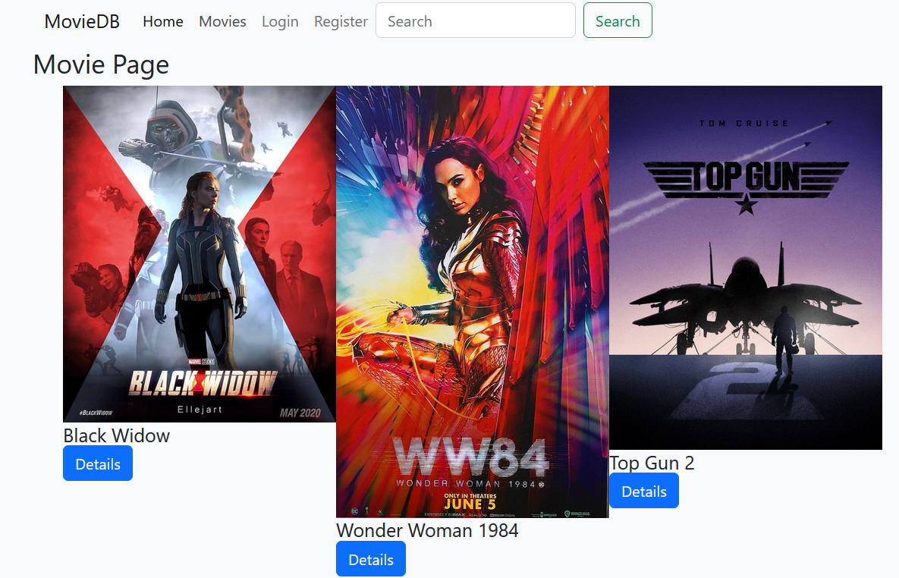
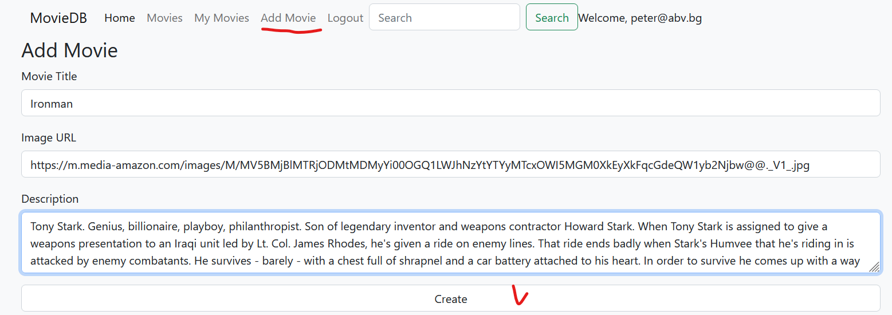
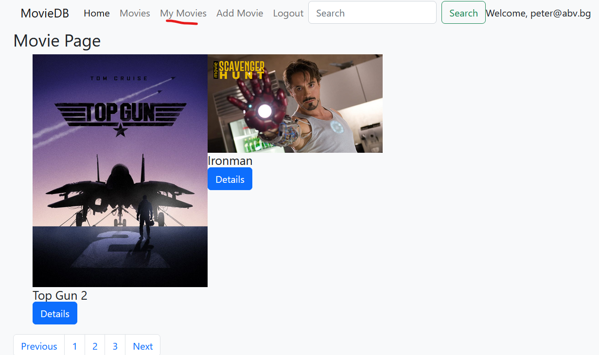
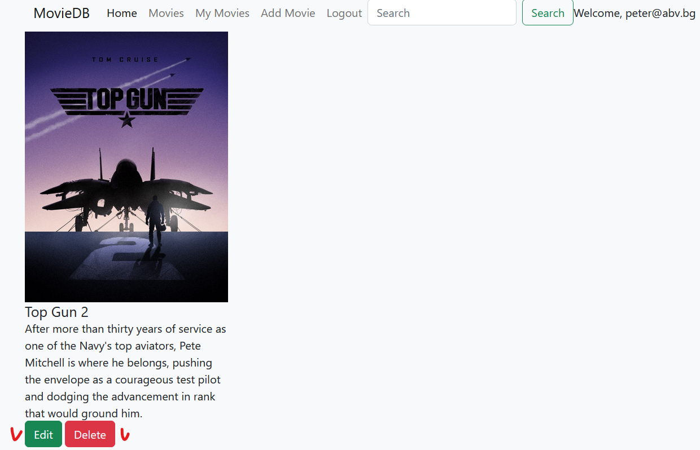
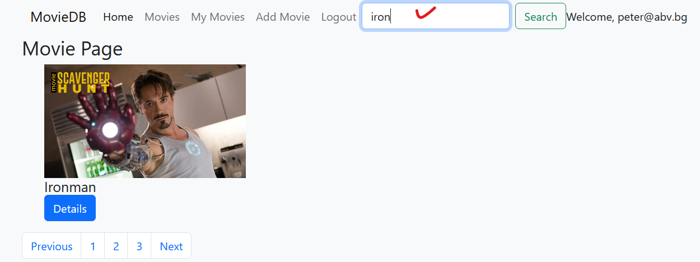

#  Demo project for uploading movie posters - a web application

## Deployed at
* SoftUni backend server deployed at Heroku using Heroku CLI - start it at https://movies-softuni.herokuapp.com/data and https://movies-softuni.herokuapp.com/data/movies
* Client server deployed at GitHub Pages at - **https://movies-softuni.github.io/** - for testing you can log in quickly with **e-mail: peter@abv.bg** and **password: 123456**
* Client server was deployed time ago also at Firebase at (currently not working) - https://movies-softuni-7ea72.web.app/   and  https://movies-softuni-7ea72.firebaseapp.com/

## Functionality
* Registration functionality not done yet!
* Logging in/out - for testing you can log in quickly with **e-mail: peter@abv.bg** and **password: 123456**
* Movies

* Adding a movie - we upload movie name, image URL from WWW and description.

* My Movies

* Details section with Edit and Delete buttons

* Searching movie by movie title

* **Important:** After every restart of the backend server of SoftUni(deployed at Heroku), the newly uploaded movie posters are deleted and we have the base of 3 hardcored initial movies.

## Technologies
* HTML, CSS, JavaScript
* lit-html, page

## Screens (pages)
* **homeView** (landing page)
* **loginView(Register)** - Login (registration is not done yet) with e-mail, username, password. For testing you can log in quickly with e-mail: peter@abv.bg and password: 123456
* **addMovieView** - adding a new movie poster
* **movieDetailsView** - details of the movie
* **editMovieView** - editing the movies
* **deleteMovieView** - deleting the movie
* **navigationView** - dynamic solution for displayng the navigator elements

## Middlewares
* **authMiddleware** - if a user logs in, then set it to the context
* **renderMiddleware** - render dynamically the given info in a div element with property class="root" (the main content of the web application)
* **navigationMiddleware** - render dynamically the given info in a div element with property class="navigation" (the navigation part)
* **querystringMiddleware** - take from the URI all pairs separated by "=". For example: ?search=top. We use it for the searching movies by movie title

## Backend services
* **using the style Fetch()**
fetch()
    .then(header/response => ())
    .then(resolvedPromise/data => ())

* **requester and endpoints** - setting endpoints for the backend server - currently starting with heroku domain (generally can be any other address where we deploy the backend server). We bind all the kinds of http requests like GET, POST, PUT, DELETE with the idea to use them also when more complexity appears.

* **movieService** - on the base of requester and endpoints, and custom HTTP requests specific for working with our movies.

## Refreshing the SinglePageApplication
* **added 404.html and initial script in the index.html file** - in order our single page application (SPA) not to crash when re-loading a page

